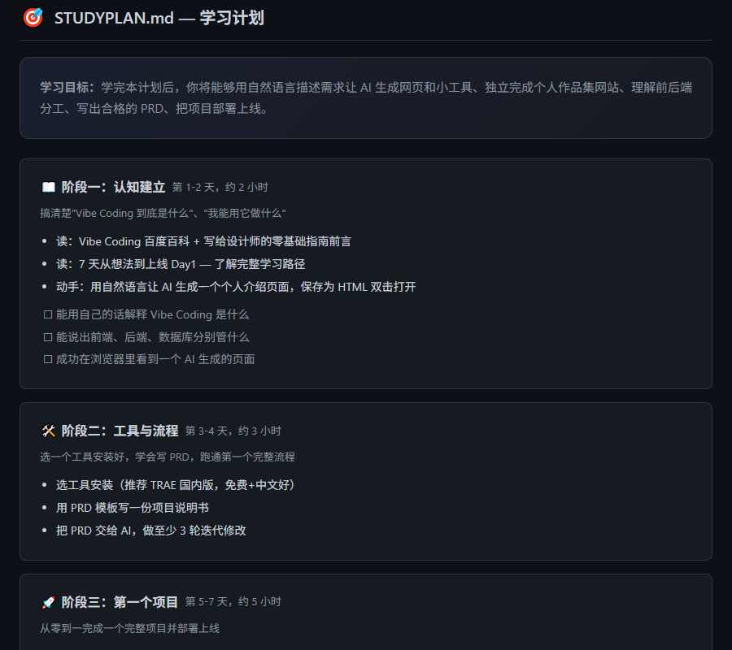

# /research — 网页知识采集技能

一句话把网页变成知识。采集 → 精排 → 学习计划，全自动。

## 前置条件

- **Obsidian** 已安装运行
- **[obsidian-local-rest-api](https://github.com/coddingtonbear/obsidian-local-rest-api)** 插件已启用并生成 API Key
- **Node.js** >= 18

## 安装

### 一行安装

```bash
npx github:xuehai3-cyber/research-skill
```

**全自动：** 下载 → 从 Obsidian 自动读取 API Key → 验证连接。**零手动输入。**

> 剪藏功能需要 [fetch-webpage](https://github.com/xuehai3-cyber/fetch-webpage) 技能（独立安装），但不影响 report / studyplan 使用。

### 手动安装

**Windows (PowerShell):**
```powershell
irm https://raw.githubusercontent.com/xuehai3-cyber/research-skill/master/install.ps1 | iex
```

**macOS / Linux:**
```bash
curl -fsSL https://raw.githubusercontent.com/xuehai3-cyber/research-skill/master/install.sh | bash
```

## 使用

在 Claude Code 中，只需说：

> "我想 7 天学会用 Claude Code 写出一个可用的程序"

Claude 会自动：
1. 🔍 搜索相关文章
2. ✅ 让你勾选感兴趣的
3. 📥 逐篇剪藏到 Obsidian
4. 📝 精排每篇文章（清理噪音、统一排版）
5. 📋 生成 INDEX.md 知识总览
6. 🎯 生成 STUDYPLAN.md 学习计划

也可以单独使用某一步：
- "剪藏 https://example.com" — 只采集
- "帮我整理技术分类下的文章" — 只出报告
- "给这些资料做个学习计划" — 只做计划

## 案例展示

以"Vibe Coding 零基础入门"为例，/research 全自动生成了 15 篇文章的知识库：

### INDEX.md — 知识总览

自动分类、排序、标注重点，生成建议阅读路径：


### STUDYPLAN.md — 学习计划

7 天四阶段学习路径，含动手任务、检查点和时间估算：



## 文件结构

```
~/.claude/skills/research/
├── package.json     npx 一行安装入口
├── setup.js         自动配置（从 Obsidian 读 Key）
├── install.sh       macOS/Linux 安装脚本
├── install.ps1      Windows 安装脚本
├── research.js      CLI 入口
├── rest-api.js      REST API 封装
├── SKILL.md         Claude 技能说明
└── README.md        本文件
```

## 许可

MIT
